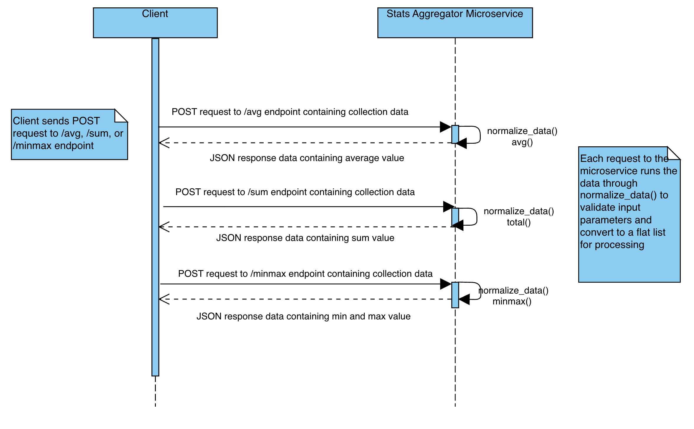

# Stats Aggregator Microservice

## Description

The **Stats Aggregator Microservice** calculates and returns statistical
calculations for a collection of numerical values or objects.

## Quickstart

```sh
# Create virtual environment
$ python3 -m venv .venv

# Activate virutal environment
$ .venv/bin/activate

# Install dependencies
$ pip install -r requirements.txt

# Run dev server
$ fastapi dev main.py
```

## Requesting data

Request data by sending a POST request to one of the three microservice
endpoints, depending on what calculations you want to perform. Data can be a
list of values, or a list of dictionary objects to be compared by a specified
key.

### Endpoints

- `/avg`: Returns the mean average of the collection.
- `/sum`: Returns the total of the collection.
- `/minmax`: Returns the minimum and maximum value (or corresponding object, for
  dict payloads) of the collection.

### Required input format

For a numeric/list collection, provide the values and indicate the payload type
`'list'`:

```
{
    'vals': [5, 7, 9, 44, 13.7523, -10],
    'payload_type': 'list'
}
```

For a dictionary collection, provide the list of dict objects, the key upon
which to perform statistical calculations, and indicate the payload type. 
The provided key must be present in all dict objects.
`'dict'`:

```
{
    'vals': [{'name': 'rufus', 'age': 5},
             {'name': 'todd', 'age': 6},
             {'name': 'marx', 'age': 7}],
    'payload_type': 'dict',
    'key': 'age'
}
```

### Sample requests

```py
# /avg endpoint, list input
requests.post('http://localhost:8000/avg', {
        'vals': [5, 7, 9, 44, 13.7523, -10],
        'payload_type': 'list'
    }
)

# /avg endpoint, dict input
requests.post('http://localhost:8000/avg', {
        'vals': [{'name': 'rufus', 'age': 5},
                {'name': 'todd', 'age': 6},
                {'name': 'marx', 'age': 7}],
        'payload_type': 'dict',
        'key': 'age'
    }
)

# /sum endpoint, list input
requests.post('http://localhost:8000/sum', {
        'vals': [5, 7, 9, 44, 13.7523, -10],
        'payload_type': 'list'
    }
)

# /sum endpoint, dict input
requests.post('http://localhost:8000/sum', {
        'vals': [{'name': 'rufus', 'age': 5},
                {'name': 'todd', 'age': 6},
                {'name': 'marx', 'age': 7}],
        'payload_type': 'dict',
        'key': 'age'
    }
)

# /minmax endpoint, list input
requests.post('http://localhost:8000/minmax', {
        'vals': [5, 7, 9, 44, 13.7523, -10],
        'payload_type': 'list'
    }
)

# /minmax endpoint, dict input
requests.post('http://localhost:8000/minmax', {
        'vals': [{'name': 'rufus', 'age': 5},
                {'name': 'todd', 'age': 6},
                {'name': 'marx', 'age': 7}],
        'payload_type': 'dict',
        'key': 'age'
    }
)
```

## Responses

Responses are received as HTTP JSON response data resulting from the client's
POST request. Data is received in the format below.

### Sample responses

```
# /avg endpoint, list input
Status Code: 200 OK
Headers:
Date: []
Content-type: application/json
Content-length: []
Body:
{'avg': 11.458716666666668}

# /avg endpoint, dict input
Status Code: 200 OK
Headers:
Date: []
Content-type: application/json
Content-length: []
Body:
{'avg': 6.0}

# /sum endpoint, list input
Status Code: 200 OK
Headers:
Date: []
Content-type: application/json
Content-length: []
Body:
{'total': 68.7523}

# /sum endpoint, dict input
Status Code: 200 OK
Headers:
Date: []
Content-type: application/json
Content-length: []
Body:
{'total': 18.0}

# /minmax endpoint, list input
Status Code: 200 OK
Headers:
Date: []
Content-type: application/json
Content-length: []
Body:
{
    'key': None,
    'min': -10,
    'max': 44
}

# /minmax endpoint, dict input
Status Code: 200 OK
Headers:
Date: []
Content-type: application/json
Content-length: []
Body:
{
    'key': 'age',
    'min': [{'name': 'rufus', 'age': 5}],
    'max': [{'name': 'marx', 'age': 7}]
}
```

## UML Diagram


